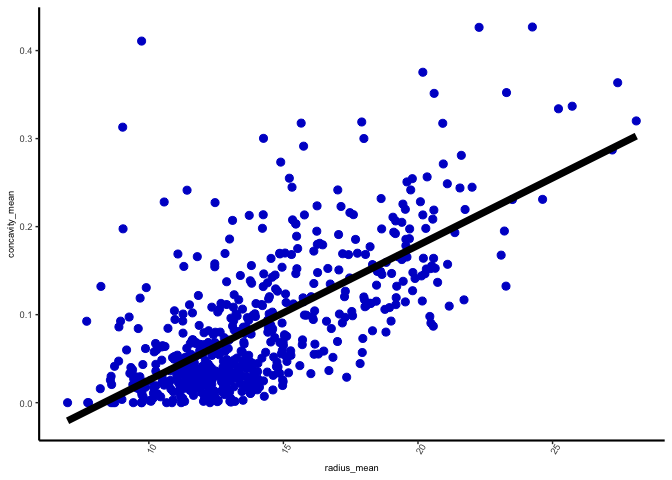
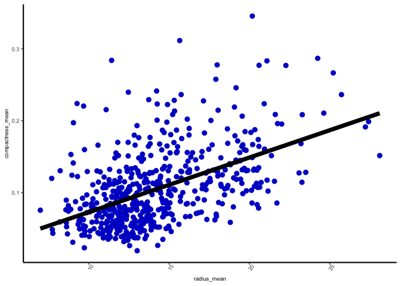
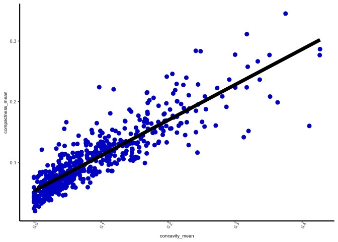
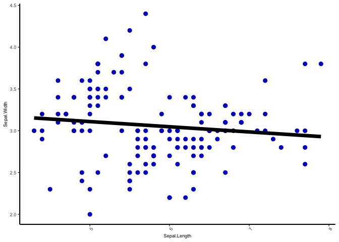
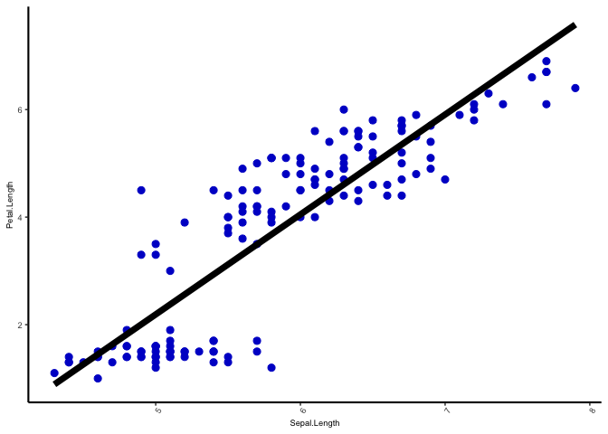
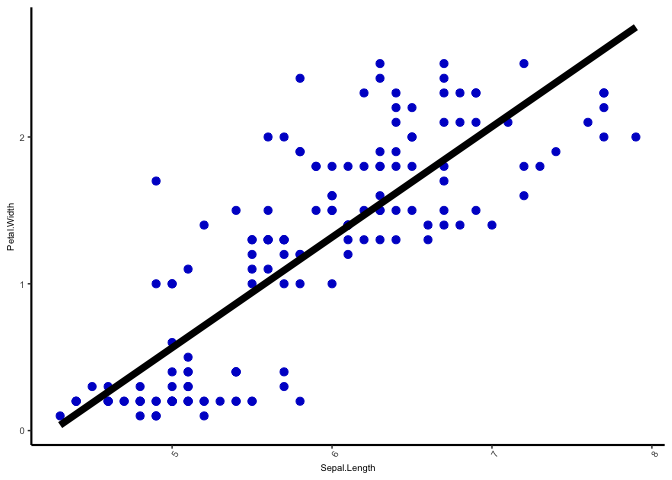
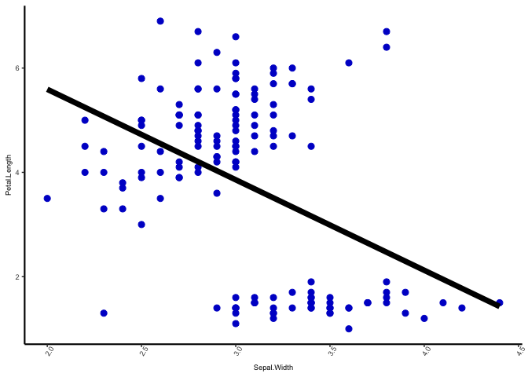
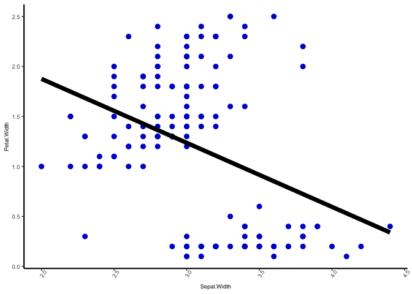
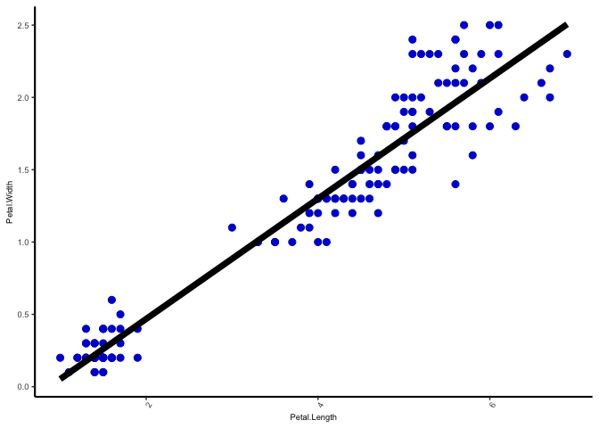

STAT 545B Assignment b1
================
Joel Campbell
2024-10-30

This R markdown file contains the required deliverables for STAT 545B
assignment b1.

#### Load Libraries

``` r
library(tidyverse)
```

    ## ── Attaching core tidyverse packages ──────────────────────── tidyverse 2.0.0 ──
    ## ✔ dplyr     1.1.4     ✔ readr     2.1.5
    ## ✔ forcats   1.0.0     ✔ stringr   1.5.1
    ## ✔ ggplot2   3.5.1     ✔ tibble    3.2.1
    ## ✔ lubridate 1.9.3     ✔ tidyr     1.3.1
    ## ✔ purrr     1.0.2     
    ## ── Conflicts ────────────────────────────────────────── tidyverse_conflicts() ──
    ## ✖ dplyr::filter() masks stats::filter()
    ## ✖ dplyr::lag()    masks stats::lag()
    ## ℹ Use the conflicted package (<http://conflicted.r-lib.org/>) to force all conflicts to become errors

``` r
library(datateachr)
library(testthat)
```

    ## 
    ## Attaching package: 'testthat'
    ## 
    ## The following object is masked from 'package:dplyr':
    ## 
    ##     matches
    ## 
    ## The following object is masked from 'package:purrr':
    ## 
    ##     is_null
    ## 
    ## The following objects are masked from 'package:readr':
    ## 
    ##     edition_get, local_edition
    ## 
    ## The following object is masked from 'package:tidyr':
    ## 
    ##     matches

#### Create Function

``` r
#' Scatter Plots
#' 
#' @description A function that produces scatter plots of all possible combination of numerical variables within a data frame or table. This function is meant to help compare how each numerical variable relates to one another, which can aid in data exploration and feature selection.
#'
#' @param df_to_plot A data frame containing at least two numeric columns, I named it this way since it seemed descriptive and good for readability
#'
#' @return A list containing scatter plots of all combinations of numeric columns
#' @export
generate_scatter_plots <- function(df_to_plot) {
  #check to make sure that the passed parameter is a data frame or table
  expect_equal(
   any(class(df_to_plot) %in% c("data.frame","tbl_df","tbl")), 
    TRUE, 
    info = paste(
      "Expected the passed parameter to be a data frame, but it was of class:", 
      class(df_to_plot)
      )
    )
  
  # create a data frame containing only numeric columns from the passed param
  filtered_df <- df_to_plot %>%
    select_if(is.numeric)
  
  # filter out all of the NA values
  filtered_df <- filtered_df %>%
    filter(complete.cases(.))
  
  # check to make sure there are at least 2 columns to plot in filtered_df
  expect_equal(
    ncol(filtered_df) >= 2, 
    TRUE, 
    info = paste(
      "Expected at least 2 numeric columns, but found", 
      ncol(filtered_df)
      )
    )
  
  # use combn(simplify = FALSE) to create a list of all combinations of the
  # numeric columns
  df_combos <- combn(names(filtered_df), 2, simplify = FALSE)
  
  # using map() from the purrr package and an anonymous function, generate 
  # a list of combos plots for each combination of numerical variables
  scatter_plots <- map(df_combos, function(combos) {
      
      ggplot(filtered_df, aes(x = .data[[combos[1]]], y = .data[[combos[2]]])) + 
      
        # scatter plot
        geom_point(color = "mediumblue", size = 2.5) +
      
        # linear trend line
        geom_smooth(
          method = "lm", 
          se = FALSE, 
          color = "black", 
          linewidth = 2.5
          ) +
      
        theme_classic() +
  
        theme(
          axis.line = element_line(linewidth = 0.75),
          panel.grid.major = element_blank(),
          panel.grid.minor = element_blank(),
          panel.border = element_blank(),
          panel.background = element_blank(),
          axis.title.x = element_text(size = 7),
          axis.title.y = element_text(size = 7),
          axis.text.x = element_text(size = 7, angle = 60),
          axis.text.y = element_text(size = 7)
        )
    })
  
  return(scatter_plots)
  
}
```

#### Examples

Example 1: generate three scatter plots from a subset of the
cancer_sample data frame, which is contained in the datateachr R
package. The three numerical selected are: - radius_mean -
concavity_mean - compactness_mean

``` r
cancer_sample_subset <- cancer_sample %>%
  select(radius_mean, concavity_mean, compactness_mean)

generate_scatter_plots(cancer_sample_subset)
```

    ## [[1]]

    ## `geom_smooth()` using formula = 'y ~ x'

<!-- -->

    ## 
    ## [[2]]

    ## `geom_smooth()` using formula = 'y ~ x'

<!-- -->

    ## 
    ## [[3]]

    ## `geom_smooth()` using formula = 'y ~ x'

<!-- -->
Example 2: generate 6 scatter plots using the iris data set that is
built into R.

``` r
generate_scatter_plots(iris)
```

    ## [[1]]

    ## `geom_smooth()` using formula = 'y ~ x'

<!-- -->

    ## 
    ## [[2]]

    ## `geom_smooth()` using formula = 'y ~ x'

<!-- -->

    ## 
    ## [[3]]

    ## `geom_smooth()` using formula = 'y ~ x'

<!-- -->

    ## 
    ## [[4]]

    ## `geom_smooth()` using formula = 'y ~ x'

<!-- -->

    ## 
    ## [[5]]

    ## `geom_smooth()` using formula = 'y ~ x'

<!-- -->

    ## 
    ## [[6]]

    ## `geom_smooth()` using formula = 'y ~ x'

<!-- -->

Example 3: creating a table that has only one numeric column, to
purposefully throw the “less than 2 numeric columns” error.

``` r
col1 <- c("H", "E", "L", "L", "O")
col2 <- c(TRUE, TRUE, TRUE, TRUE, TRUE)
col3 <- c(1, 2, 3, 4, 5)

df_one_numeric <- data.frame(col1, col2, col3)

generate_scatter_plots(df_one_numeric)
```

    ## Error: ncol(filtered_df) >= 2 not equal to TRUE.
    ## 1 element mismatch
    ## Expected at least 2 numeric columns, but found 1

#### Testing

Test 1: create a data frame with all numeric values in all columns and
that the “less than 2 numeric columns: error is thrown.

``` r
test_df1_col1 <- c("NA", "NA", "NA", "NA")
test_df1_col2 <- c("NA", "NA", "NA", "NA")
test_df1_col3 <- c("NA", "NA", "NA", "NA")

test_df1 <- data.frame(test_df1_col1, test_df1_col2, test_df1_col3)

test_that("all NA columns causes a 'less than 2 numeric columns' error", {
  expect_error(
    generate_scatter_plots(test_df1), 
    "Expected at least 2 numeric columns, but found 0"
    )
})
```

    ## Test passed 🌈

Test 2: create a data frame with all numeric columns, but only NA valus,
to test that no error is thrown and all plots produced have no data.

``` r
test_df2 <- data.frame(
  matrix(
    as.numeric(NA),
    nrow = 5,
    ncol = 6
    )
  )

plot_list <- generate_scatter_plots(test_df2)

test_that("all NA numeric columns makes a list of plots that contain no data", {
  plot_list <- generate_scatter_plots(test_df2)
  for(plot in plot_list) {
    expect_true(nrow(plot$data) == 0)
  }
})
```

    ## Test passed 🎊

Test 3: separately create a list of ggplot object from a subset of iris
columns (Sepal.Length, Sepal.Width, Petal.Length), and use the
generate_scatter_plots() function on the same subset. These two ggplot
object list are then compared in terms of both length, and the data
stored in each matching ggplot object.

``` r
# filtered the test data frame to only include 3 columns for less repeated code
test_iris <- iris %>%
  select(Sepal.Length, Sepal.Width, Petal.Length)
  
# generate the Sepal.Length x Sepal.Width scatter plot
test_ggplot1 <- ggplot(test_iris, aes(x = Sepal.Length, y = Sepal.Width)) + 
        geom_point(color = "mediumblue", size = 2.5) +
        geom_smooth(
          method = "lm", 
          se = FALSE, 
          color = "black", 
          linewidth = 2.5
          ) +
        theme_classic() +
        theme(
          axis.line = element_line(linewidth = 0.75),
          panel.grid.major = element_blank(),
          panel.grid.minor = element_blank(),
          panel.border = element_blank(),
          panel.background = element_blank(),
          axis.title.x = element_text(size = 7),
          axis.title.y = element_text(size = 7),
          axis.text.x = element_text(size = 7, angle = 60),
          axis.text.y = element_text(size = 7)
        )

# generate the Sepal.Length x Petal.Length scatter plot
test_ggplot2 <- ggplot(test_iris, aes(x = Sepal.Length, y = Petal.Length)) + 
        geom_point(color = "mediumblue", size = 2.5) +
        geom_smooth(
          method = "lm", 
          se = FALSE, 
          color = "black", 
          linewidth = 2.5
          ) +
        theme_classic() +
        theme(
          axis.line = element_line(linewidth = 0.75),
          panel.grid.major = element_blank(),
          panel.grid.minor = element_blank(),
          panel.border = element_blank(),
          panel.background = element_blank(),
          axis.title.x = element_text(size = 7),
          axis.title.y = element_text(size = 7),
          axis.text.x = element_text(size = 7, angle = 60),
          axis.text.y = element_text(size = 7)
        )

# generate the Sepal.Width x Petal.Length scatter plot
test_ggplot3 <- ggplot(test_iris, aes(x = Sepal.Width, y = Petal.Length)) + 
        geom_point(color = "mediumblue", size = 2.5) +
        geom_smooth(
          method = "lm", 
          se = FALSE, 
          color = "black", 
          linewidth = 2.5
          ) +
        theme_classic() +
        theme(
          axis.line = element_line(linewidth = 0.75),
          panel.grid.major = element_blank(),
          panel.grid.minor = element_blank(),
          panel.border = element_blank(),
          panel.background = element_blank(),
          axis.title.x = element_text(size = 7),
          axis.title.y = element_text(size = 7),
          axis.text.x = element_text(size = 7, angle = 60),
          axis.text.y = element_text(size = 7)
        )

# combine test_ggplots into a list
test_plot_list <- list(test_ggplot1, test_ggplot2, test_ggplot3)

# create plot list for comparison using generate_scatter_plots
filtered_plot_list <- generate_scatter_plots(test_iris)

test_that("generated ggplot object has same structure", {
  # check that filtered_plot_list has the same length as test_plot_list
  expect_equal(length(filtered_plot_list), length(test_plot_list))
  
  
  # check that the data for each of the ggplot objects is the same
  for(i in 1:length(test_plot_list)) {
    expect_equal(filtered_plot_list[i]$data, test_plot_list[i]$data)
  }
})
```

    ## Test passed 😀
